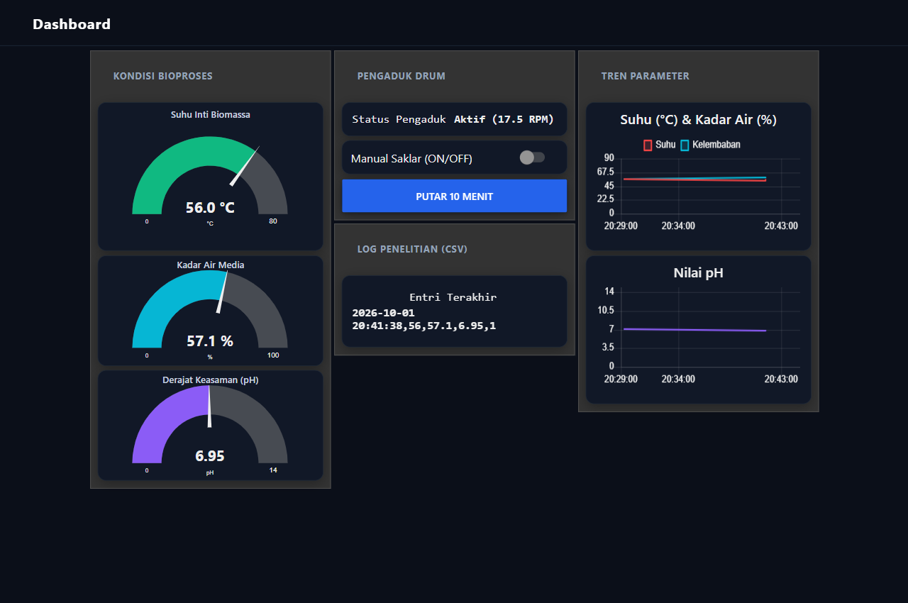
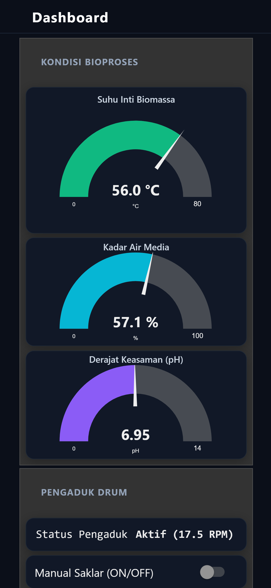

# ECO-MATE: Automated Rotary Drum Composter IoT & Monitoring System

[ English ](README.md) | [ Bahasa Indonesia ](README-id.md)

---

[](LICENSE)
[](https://www.espressif.com/)
[](https://nodered.org/)
[](https://mqtt.org/)
[](https://nodered.org/)

An automated bioprocess data acquisition and actuator control system for horizontal rotary drum composters, powered by the **NodeMCU ESP32** and **Node-RED Dashboard**. Developed for researching aerobic co-composting kinetics of leaf litter and campus food waste at the **Department of Environmental Health, Poltekkes Kemenkes Bandung (Group 3A)**.

---

## Dashboard User Interface (UI/UX)

The user interface is engineered with **Mobile-First Responsive** architecture, clean industrial typography, and a semantic *Deep Slate* color palette (60-30-10 rule) for real-time monitoring and control.

### 1. Desktop & Tablet Viewport
A clean two-column grid displaying real-time bioprocess metrics, drum agitator state and controls, temperature dynamics charts, and research CSV logger entries.



### 2. Mobile Viewport (Smartphone)
A single-column layout optimized for one-thumb field operation, featuring high-contrast radial gauges, minimum $48\text{ px}$ touch targets, and zero horizontal scrolling on standard smartphone displays ($375\text{--}390\text{ px}$).



---

## Key System Features

1. **Embedded MQTT Broker (Aedes Port 1883)**:
   - Node-RED functions directly as a local MQTT broker on port 1883 without requiring third-party broker daemons (such as Mosquitto).
2. **Multi-Sensor Bioprocess Monitoring**:
   - **Core Biomass Temperature**: Stainless steel SUS 304 waterproof probe DS18B20 ($0\text{--}80^\circ\text{C}$) with active thermophilic target zone ($45\text{--}65^\circ\text{C}$, green indicator).
   - **Media Moisture Content**: Capacitive Soil Moisture Sensor v1.2 ($0\text{--}100\%$, optimal range $40\text{--}70\%$).
   - **Acidity Level (pH)**: Analog glass electrode probe E-201-C ($0\text{--}14\text{ pH}$).
3. **Drum Agitator Control (17.5 RPM)**:
   - **Operational State**: Real-time status display (`Aktif (17.5 RPM)` vs `Standby`).
   - **Manual Override**: Instant ON/OFF toggle switch from the dashboard.
   - **Quick Cycle Button**: Triggers drum agitation for exactly 10 minutes with automatic shutoff.
   - **Automated Timer**: Pre-programmed routine rotating the drum for 10 minutes every 4 hours.
4. **Automated Research Datalogger (21-Day Serial Time-Series)**:
   - Each incoming telemetry packet is automatically appended to a local CSV file for statistical analysis, degradation curve modeling, and final research reporting.

---

## System Architecture

```text
[ Drum Bioprocess Sensors ]
  - DS18B20 (Core Temperature SUS 304)
  - Capacitive v1.2 (Moisture Content)
  - E-201-C (Acidity pH)
         │
         ▼
  [ NodeMCU ESP32 ] ──(GPIO 26)──> [ Relay & AC Contactor (17.5 RPM Motor) ]
         │
         │ (Wi-Fi 2.4 GHz / MQTT JSON Telemetry Port 1883)
         ▼
 [ Host Machine: Node-RED Server ]
   ├── Embedded Aedes MQTT Broker (Port 1883)
   ├── Bioprocess Logic & Timer Engine
   ├── CSV Datalogger (data-ecomate-log.csv)
   └── Web UI Dashboard (Port 1880/ui) ──> Accessible from PC & Mobile
```

---

## Repository Directory Structure

```text
ecomate-iot-system/
├── .gitignore                      # Excludes cache, build artifacts, and private credentials
├── LICENSE                         # Open-source MIT License
├── README.md                       # Primary documentation (English)
├── README-id.md                    # Full documentation (Bahasa Indonesia)
├── docs/
│   └── images/
│       ├── dashboard-desktop.png   # Desktop UI screenshot
│       └── dashboard-mobile.png    # Mobile UI screenshot
├── firmware/
│   └── ecomate-esp32/
│       └── ecomate-esp32.ino       # Arduino C++ firmware for NodeMCU ESP32
├── nodered/
│   └── flows.json                  # Active Node-RED Dashboard flow configuration
└── simulation/
    └── simulate-esp32.py           # Python telemetry simulator for hardware-free testing
```

---

## ESP32 Hardware Pinout & Wiring

Connect the sensors and modules to the NodeMCU ESP32 board according to the pinout below:

| Component | Module Pin | ESP32 GPIO | Description & Wiring Notes |
| :--- | :--- | :--- | :--- |
| **DS18B20 Temperature** | VCC | 3.3V | Install a $4.7\text{ k}\Omega$ pull-up resistor between VCC and DATA |
| | GND | GND | |
| | DATA | **GPIO 4** | 1-Wire communication bus |
| **Capacitive Moisture v1.2** | VCC | 3.3V | Power with 3.3V to keep analog output within ESP32 ADC limits |
| | GND | GND | |
| | AOUT | **GPIO 34** | ADC1 channel (free from Wi-Fi interference) |
| **pH Probe E-201-C** | VCC | 5V | Analog signal conditioning board |
| | GND | GND | Common ground with ESP32 |
| | PO | **GPIO 35** | ADC1 channel |
| **1-Channel Relay Module** | VCC | 5V | Powers the relay coil |
| | GND | GND | |
| | IN | **GPIO 26** | Controls the Schneider LC1D09 220V AC contactor |
| **Buzzer Alarm 85 dB** | (+) | **GPIO 27** | Local audio alarm triggered when temperature $>70^\circ\text{C}$ |
| | (-) | GND | |

---

## Step-by-Step Setup & Deployment Guide

### 1. Host Machine / PC Setup
1. Install **Node.js** (LTS) from [nodejs.org](https://nodejs.org/).
2. Install **Node-RED** globally:
   ```bash
   npm install -g --unsafe-perm node-red
   ```
3. Install required dashboard and broker modules in the Node-RED user directory (`~/.node-red`):
   ```bash
   cd ~/.node-red
   npm install node-red-dashboard node-red-contrib-aedes
   ```
4. Copy the flow configuration file from this repository to your Node-RED directory:
   - Copy `nodered/flows.json` to `C:\Users\<user>\.node-red\flows.json` (on Windows).
5. Start the Node-RED server:
   ```bash
   node-red
   ```

### 2. Determine Host Machine Local IP Address
Open a terminal / PowerShell on the host PC and execute:
```powershell
ipconfig
```
Note the **IPv4 Address** of your active Wi-Fi adapter (e.g., `192.168.1.15`).

### 3. Configure & Flash ESP32 Firmware
1. Open `firmware/ecomate-esp32/ecomate-esp32.ino` in the **Arduino IDE**.
2. Install the following libraries via the **Library Manager**:
   - `PubSubClient`
   - `OneWire`
   - `DallasTemperature`
   - `ArduinoJson`
3. Update the Wi-Fi and MQTT parameters at the top of the file:
   ```cpp
   const char* WIFI_SSID     = "YOUR_WIFI_SSID";
   const char* WIFI_PASSWORD = "YOUR_WIFI_PASSWORD";
   const char* MQTT_SERVER   = "192.168.1.15"; // Host PC IP address
   const int   MQTT_PORT     = 1883;
   ```
4. Select the **ESP32 Dev Module** board, choose the corresponding COM port, and click **Upload**.

### 4. Access the Live Dashboard
- **From PC**: Open a browser and navigate to `http://localhost:1880/ui`
- **From Smartphone**: Connect to the same Wi-Fi network and open `http://<HOST_IP>:1880/ui` (e.g., `http://192.168.1.15:1880/ui`).

---

## Hardware-Free Testing (Python Simulator)

If the composter drum or sensor probes are still in mechanical assembly, you can test the entire dashboard flow using the included simulator script:

1. Install the MQTT client library:
   ```bash
   pip install paho-mqtt
   ```
2. Run the simulator:
   ```bash
   python simulation/simulate-esp32.py
   ```
3. The simulator generates realistic bioprocess telemetry data every 5 seconds and responds to drum motor commands in real time.

---

## Telemetry Data Formats

### Ingress MQTT JSON Payload (`ecomate/telemetry`)
```json
{
  "suhu": 56.0,
  "kelembaban": 57.1,
  "ph": 6.95,
  "motor": 1
}
```

### CSV Datalogger Format (`data-ecomate-log.csv`)
Logged entries appended on the host machine for the 21-day experiment:
```csv
Timestamp,Suhu,Kelembaban,pH,StatusMotor
2026-10-01 20:41:38,56.0,57.1,6.95,1
2026-10-01 20:42:08,56.2,57.0,6.96,1
```

---

## License

This project is open-source and licensed under the [MIT License](LICENSE).
Developed for academic research, environmental sanitation engineering, and open technological innovation.
